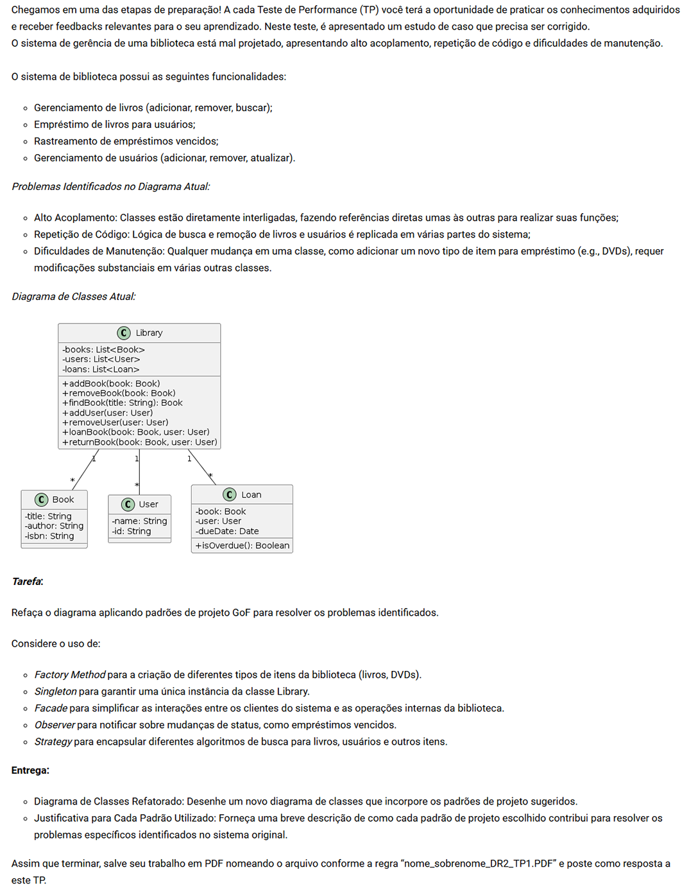

# Desenvolvimento de Serviços com SpringBoot

# TP1 - Questões (11)

Modo de Uso:

- No projeto tem 4 arquivos do plantUML, cada um é uma etapa da refaoração, até chegar no último que é a etapa final
- dc_etapa00_original.puml
- dc_etapa01.puml
- dc_etapa02.puml
- dc_etapa03_final_refatorado.puml

